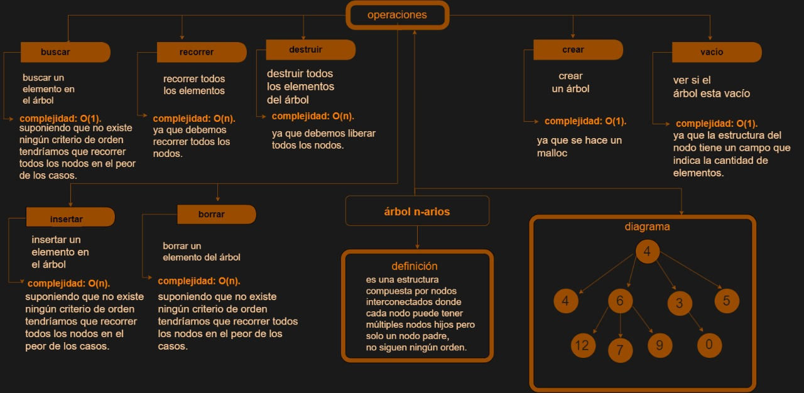

# TDA ABB

## Repositorio de marianela fernanda gareca janko - 109606 - fernanda.gareca321@gmail.com

- Para compilar:

```bash
make pruebas_chanutron
```

- Para ejecutar:

```bash
./pruebas_chanutron
```

- Para ejecutar con valgrind:
```bash
make valgrind-chanutron
```
---
##  Funcionamiento

El tda abb consiste en una estructura con nodos partiendo de un nodo raíz, donde cada nodo puede tener hasta dos nodos hijos, pero solo un nodo padre, los cuales respetan un orden donde los elementos menores se encuentran en el subárbol izquierdo y los elementos mayores se encuentran en el subárbol derecho buscando optimizar la operación de búsqueda.


##  Interaccion con la memoria


### diagrama de memoria:

En el archivo `abb.c` la función `abb_crear` utiliza `malloc` para inicializar un puntero a una abb en el heap el cual tiene un campo para el comparador recibido como parámetro, un nodo raíz que será inicializada en null también tiene un campo para la cantidad de elementos que se van agregando que en un inicio estara inicialmente en 0.

```c
    // EN LA FUNCION ABB CRAR

if (comparador == NULL) {
		return NULL;
	}
	abb_t *abb = malloc(sizeof(abb_t));
	if (!abb) {
		return NULL;
	}
	abb->comparador = comparador;
	abb->nodo_raiz= NULL;
	abb->tamanio=0;
	return abb;
```
En la función `crear nodo` se utiliza `malloc` para inicializar un puntero a un nodo en el heap el cual tiene un puntero a su nodo izquierdo y derecho que seran inicilizados en null, también cuneta con un campo para el elemento que se recibe como parámetro.

```c

    // EN LA FUNCION CREAR NODO

    nodo_abb_t *nuevo_nodo = malloc(sizeof(nodo_abb_t));
	if(!nuevo_nodo){
		return NULL;
	}
	nuevo_nodo->elemento = elemento;
	nuevo_nodo->derecha= NULL;
	nuevo_nodo->izquierda= NULL;
	return nuevo_nodo;
```


<div align="center">

</div>

---

## Respuestas a las preguntas teóricas


# Arbol n-arios
<div align="center">

</div>


#  Arbol binario

<div align="center">

</div>


#  Arbol binario de busqueda

<div align="center">

</div>
