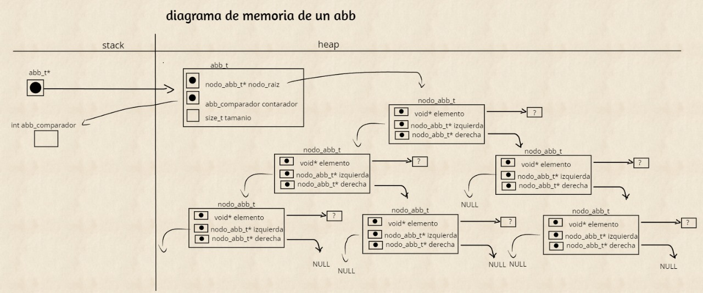

# TDA ABB

## Repositorio de marianela fernanda gareca janko - 109606 - fernanda.gareca321@gmail.com

- Para compilar:

```bash
make pruebas_chanutron
```

- Para ejecutar:

```bash
./pruebas_chanutron
```

- Para ejecutar con valgrind:
```bash
make valgrind-chanutron
```
---
##  Funcionamiento

El tda abb consiste en una estructura con nodos partiendo de un nodo raíz, donde cada nodo puede tener hasta dos nodos hijos, pero solo un nodo padre, los cuales respetan un orden donde los elementos menores se encuentran en el subárbol izquierdo y los elementos mayores se encuentran en el subárbol derecho buscando optimizar la operación de búsqueda.


##  Interaccion con la memoria


### diagrama de memoria:

En el archivo `abb.c` la función `abb_crear` utiliza `malloc` para inicializar un puntero a una abb en el heap el cual tiene un campo para el comparador recibido como parámetro, un nodo raíz que será inicializada en null también tiene un campo para la cantidad de elementos que se van agregando que en un inicio estara inicialmente en 0.

```c
    // EN LA FUNCION ABB CRAR

if (comparador == NULL) {
		return NULL;
	}
	abb_t *abb = malloc(sizeof(abb_t));
	if (!abb) {
		return NULL;
	}
	abb->comparador = comparador;
	abb->nodo_raiz= NULL;
	abb->tamanio=0;
	return abb;
```
En la función `crear nodo` se utiliza `malloc` para inicializar un puntero a un nodo en el heap el cual tiene un puntero a su nodo izquierdo y derecho que seran inicilizados en null, también cuneta con un campo para el elemento que se recibe como parámetro.

```c

    // EN LA FUNCION CREAR NODO

    nodo_abb_t *nuevo_nodo = malloc(sizeof(nodo_abb_t));
	if(!nuevo_nodo){
		return NULL;
	}
	nuevo_nodo->elemento = elemento;
	nuevo_nodo->derecha= NULL;
	nuevo_nodo->izquierda= NULL;
	return nuevo_nodo;
```


<div align="center">

</div>

---

## Respuestas a las preguntas teóricas


# Arbol n-arios
<div align="center">

</div>


#  Arbol binario

<div align="center">

</div>


#  Arbol binario de busqueda

<div align="center">

</div>

	EN el caso que el arbol este perfectamente balanceado para las operaciones de buscar insertar o eliminar  decimos que la complejidad es O(logn) ya que segun el Teorema Maestro
	la ecuacion de recurrencia seria de la forma T(N) = T(n/2) + F(1)

	se puede utilizar el teorema ya que A >= 1,B>1 y f(1) es polinomica
	buscando c = log_2(1) = 0
	
	n⁰ ---> 1 == F(1) por lo que la complejidad es: log(n)*n⁰ == O(log(n))


###  implementacion de insertar

	En la función abb_insertar, la implementación que use es recursiva para facilitar la lectura del código y aprovechar que el proceso de búsqueda de la posición para insertar es el mismo con todos los elementos, en dicha función verifico que exista el abb y hago una llamada recursiva a una nueva funcion en la cual uso la función comparadora para decidir por cuál subárbol avanzar hasta llegar a la condición de corte que seria encontrar una posición null, inserto el elemento y recortamos por ultimo aumento la cantidad.

###  implementacion de buscar


	En la funcion abb_insetar ,erifico que el abb recibido sea valido y hago un llamado a una funcion recursiva que se encarga de buscar el elemneto usando la funcion comparadora y avanzando pos uno de los dos subarboles hasta encontrarlo y devolverlo o en el caso que no se encuentre llegar a una posicion null.

###  implementacion de eliminar


	En la función abb_quitar verifico que el abb exista hago un llamado a una función recursiva que se encargara de quitar el elemento, en dicha función uso la función comparadora para avanzar por un subárbol hasta encontrar el elemento a eliminar, una vez encontrado me guardo el elemento y me fijo que caso es, en el caso que el nodo tenga un nodo hijo o no tenga nodos hijos me guardo el hijo no nulo o null en el caso que no tenga nodos hijos, libero el nodo actual y devuelvo el nodo hijo para que quede enganchado al árbol.	
	En el caso que los dos hijos existan busco el predecesor inorden en la función que busca al predecesor inorden una vez encontrado guardo su elemento y elimino el elemento enganchando su hijo izquierdo al árbol, intercambio los elementos con el elemento a eliminar y devuelvo el nodo actual para engancharlo donde corresponda y disminuyo la cantidad de elementos.

###  implementacion de destruir


	En la función abb destruir verifico que el abb sea válido y llamo a una función recursiva abb_buscar_rec donde recorro el árbol de forma postorder liberando todos los nodos hojas hasta llegar a la condición de corte donde no queden más nodos y libero el árbol.


###  implementacion de destruir todo

	En la función abb destruir todo, verifico que exista el abb y si la función destructora no es válida llamo a destruir abb, caso contrario que si exista una función destructora llamo a una función recursiva abb destruir todo rec la cual recorre el árbol de manera postorder y va aplicando la función destructora a cada elemento y libera el nodo hasta llegar al caso base donde no quedan más elementos en el árbol y procede a liberar el árbol.


###  implementacion de recorrer

	En la función abb recorrer verifico que el árbol sea válido y según el recorrido recibido llamo a una función recursiva que carga un vector con los elementos de cada nodo recorrido según el orden recibido, hasta llegar a la condición de corte donde la cantidad de elementos recorridos es igual al amaño del vector devolviendo al final la cantidad de elementos.

###  implementacion de iterar


	En la función abb recorrer verifico que el árbol y la función recibida sean válidos y según el recorrido recibido llamo a una función recursiva que recorre los nodos del árbol según el recorrido recibido y va aplicando la función a cada elemento, mientras suma una variable cantidad al terminar de iterar todos los elementos se devuelve la cantidad de elementos iterados.